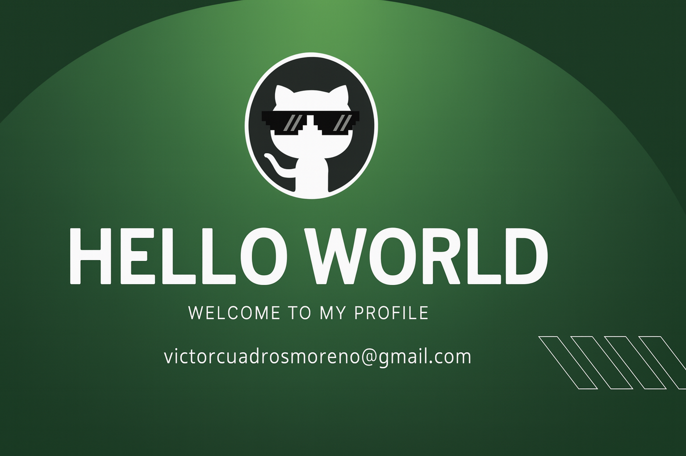

<!-- Banner -->

  

---

# 👋 Hola, soy Victor Cuadros

🎓 Estudiante de **Desarrollo de Software**  
💻 Apasionado por el **frontend** y siempre aprendiendo nuevas tecnologías.  
✨ Entusiasta del código limpio, el diseño web atractivo y las buenas prácticas.

---

## 🚀 Tecnologías que manejo

  
  
  

---

## 📌 Sobre mí

- 🔹 Me gusta transformar ideas en proyectos funcionales y atractivos.  
- 🔹 Aprendo rápido y disfruto resolver problemas con creatividad.  
- 🔹 Actualmente enfocado en mejorar mis habilidades de **frontend**.  

---

## 📫 Contacto

✉️ **victorcuadrosmoreno@gmail.com**

---
